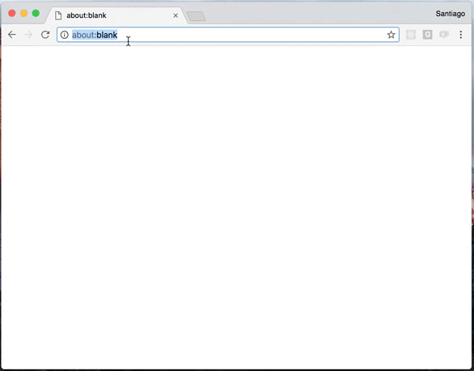

# ember-confetti
[](https://travis-ci.org/san650/ember-confetti)
[](https://emberobserver.com/addons/ember-confetti)

This addon exposes an `{{confetti-rain}}` component for your ember application.



You can see it in action in this [demo page](https://san650.github.io/ember-confetti/).

## Usage

Install the addon and insert the component in any template.

```hbs
{{confetti-rain}}
```

The component will start a confetti rain when rendered or you can toggle the rain by setting the `isEnabled` attribute.

```hbs
{{!--

  No confetti rain :-(

--}}

{{confetti-rain isEnabled=false}}
```

### Overriding z-index

By default `z-index` is set to max 32bit integer value, to override this you can set a custom class to the component and set your desired `z-index` value.

```hbs
{{confetti-rain class="my-confetti"}}
```

```css
.my-confetti {
  z-index: 10!important;
}
```

Note that you need to use the `!important` suffix so the rule is applied correctly.

## Installation

To install the addon just run

```
$ ember install ember-confetti
```

## Development

```sh
$ git clone https://github.com/san650/ember-confetti
$ cd $_
$ yarn          # (or npm install)
$ bower install
```

Running tests

```sh
$ npm test
```

## Project's health

[](https://travis-ci.org/san650/ember-confetti)
[](https://emberobserver.com/addons/ember-confetti)

## Acknowledgement

The confetti idea is based on Linmiao Xu's codepen http://codepen.io/linrock/pen/Amdhr

## License

ember-confetti is licensed under the MIT license.

See [LICENSE](./LICENSE) for the full license text.
